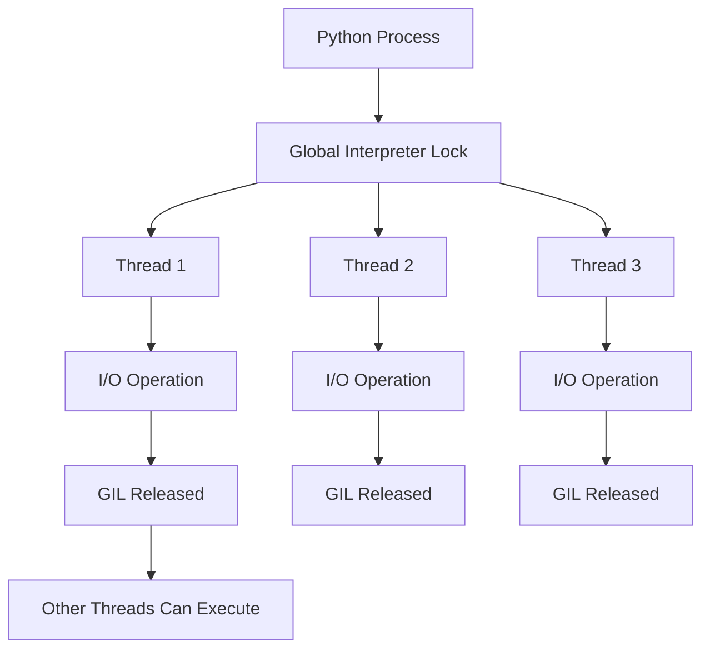
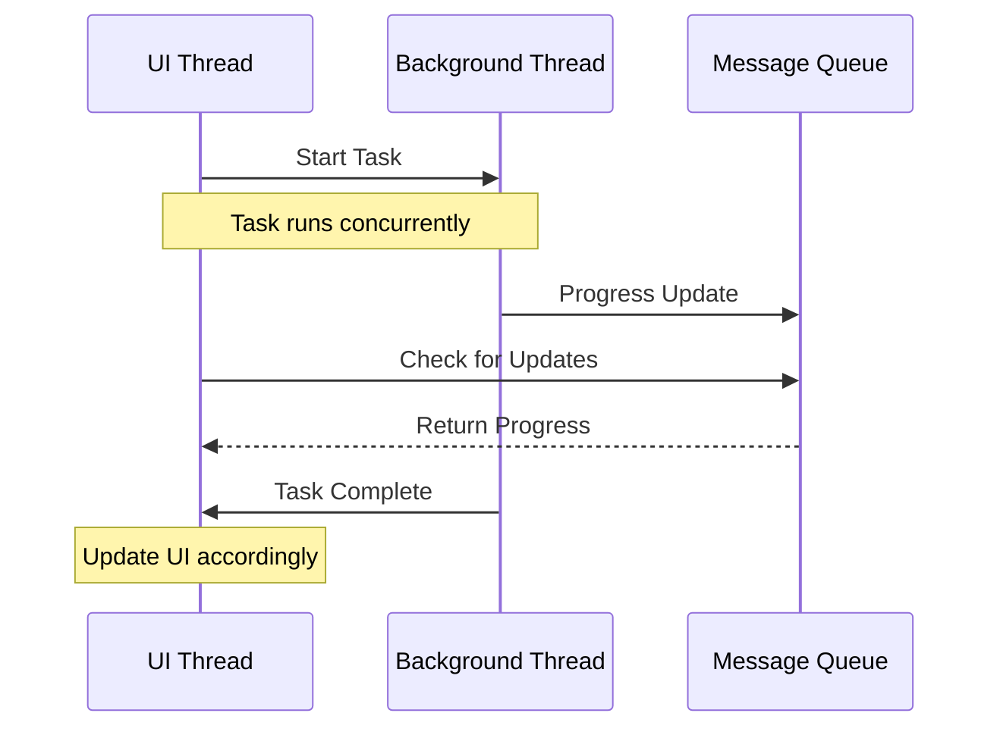

---

layout: post

title:  "Unlocking Python's Power: Multithreading for Responsive Applications"

categories: [Tutorials, Concepts]

tags: ["python", "multithreading", "ui-development", "concurrent-futures"]

mermaid: true

---
When building modern applications, especially those with user interfaces, responsiveness is king. Users expect applications that remain smooth and interactive, even when performing heavy computations or I/O operations. This is where multithreading becomes essential. In this post, we'll explore how Python handles multithreading and how you can leverage it to build better applications.

## Understanding Python's Global Interpreter Lock (GIL)

Before diving into code, it's crucial to understand Python's Global Interpreter Lock (GIL). The GIL is a mutex that allows only one thread to execute Python bytecode at a time. This means that for CPU-bound tasks, multithreading doesn't provide a performance boost in Python. However, for I/O-bound tasks (like network requests, file operations, or waiting for user input), multithreading is incredibly effective.



## Concurrent.futures: The Modern Approach to Threading

Python's `concurrent.futures` module provides a high-level interface for asynchronously executing callables. The `ThreadPoolExecutor` is particularly useful for managing a pool of worker threads.

### Basic Example: Downloading Multiple Files

Here's a practical example of downloading multiple files concurrently:

```python
import concurrent.futures
import requests

def download_file(url):
    response = requests.get(url)
    filename = url.split('/')[-1]
    with open(filename, 'wb') as f:
        f.write(response.content)
    return f"Downloaded {filename}"

urls = [
    'https://example.com/file1.jpg',
    'https://example.com/file2.jpg',
    'https://example.com/file3.jpg'
]

# Using ThreadPoolExecutor
with concurrent.futures.ThreadPoolExecutor(max_workers=3) as executor:
    # Submit tasks and get future objects
    futures = [executor.submit(download_file, url) for url in urls]
    
    # Process results as they complete
    for future in concurrent.futures.as_completed(futures):
        try:
            result = future.result()
            print(result)
        except Exception as e:
            print(f"Error: {e}")
```

### Example: Processing Data with Progress Updates

```python
import concurrent.futures
import time

def process_item(item, progress_callback=None):
    # Simulate some processing time
    time.sleep(1)
    
    # Simulate work
    result = item * 2
    
    # Callback for progress updates
    if progress_callback:
        progress_callback(item)
    
    return result

def update_progress(item):
    print(f"Processed item: {item}")

items = [1, 2, 3, 4, 5]

with concurrent.futures.ThreadPoolExecutor(max_workers=2) as executor:
    # Using map for simpler cases
    results = list(executor.map(
        lambda item: process_item(item, update_progress), 
        items
    ))
    
print(f"Final results: {results}")
```

## How Multithreading Benefits UI Development

While the code examples above demonstrate the technical aspects, the real power of multithreading shines in user interface development. Here's how it benefits UI applications without getting into specific GUI framework code:

### 1. **Maintaining UI Responsiveness**
The most significant advantage is keeping your application responsive. When you run intensive operations on the main thread (also called the UI thread), the interface freezes, becomes unresponsive, and provides a poor user experience. By moving heavy work to background threads, the UI remains smooth and interactive.

### 2. **Background Processing**
Modern applications often need to perform tasks in the background while the user continues working. Examples include:
- Auto-saving documents
- Syncing data with cloud services
- Preloading content
- Generating reports or exports

### 3. **Progress Reporting**
Background threads can communicate progress back to the UI thread, allowing you to show progress bars, status updates, or estimated completion times. This keeps users informed and engaged rather than wondering if the application has crashed.

### 4. **Concurrent Operations**
Users often want to perform multiple operations simultaneously, like downloading files while editing a document or processing images while browsing a gallery. Multithreading makes this possible without blocking the interface.

### 5. **Improved User Perception**
Even if the total processing time remains the same, an application that remains responsive *feels* faster. Users can continue working while tasks complete in the background, leading to a more efficient workflow.

## Thread Communication Patterns



## Best Practices and Considerations

1. **Don't Update UI from Background Threads**: Always communicate results back to the main thread for UI updates.

2. **Use Appropriate Pool Sizes**: For I/O-bound tasks, larger thread pools are beneficial. For CPU-bound tasks, consider multiprocessing instead.

3. **Handle Exceptions Gracefully**: Background thread exceptions shouldn't crash your application.

4. **Use Thread-Safe Data Structures**: When sharing data between threads, use proper synchronization mechanisms.

## Conclusion

Multithreading in Python, despite the GIL, is a powerful tool for building responsive applications. The `concurrent.futures` module provides a clean, intuitive API for managing thread pools, making it accessible even to developers new to concurrent programming.

For UI development specifically, multithreading is not just a performance optimization—it's a necessity for creating applications that meet modern user expectations. By keeping the UI responsive during background operations, you provide a seamless experience that users will appreciate.

Remember: the goal isn't just to make applications faster, but to make them *feel* faster and more responsive. That's where multithreading truly shines.

*Happy coding!*
